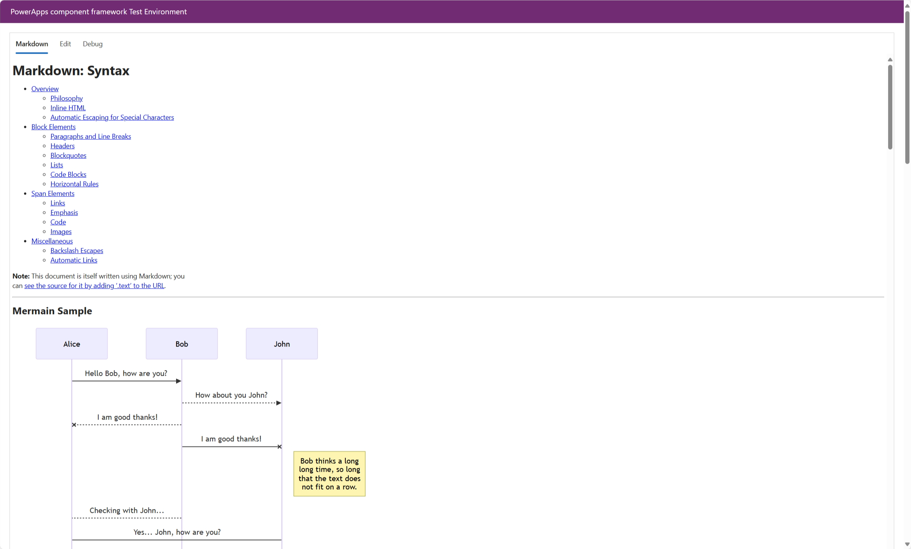
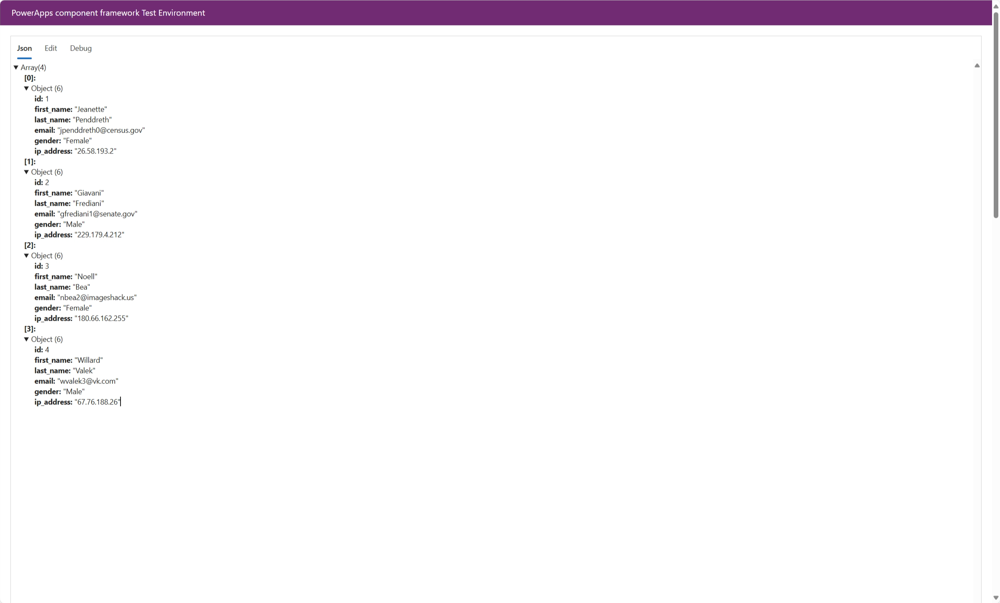
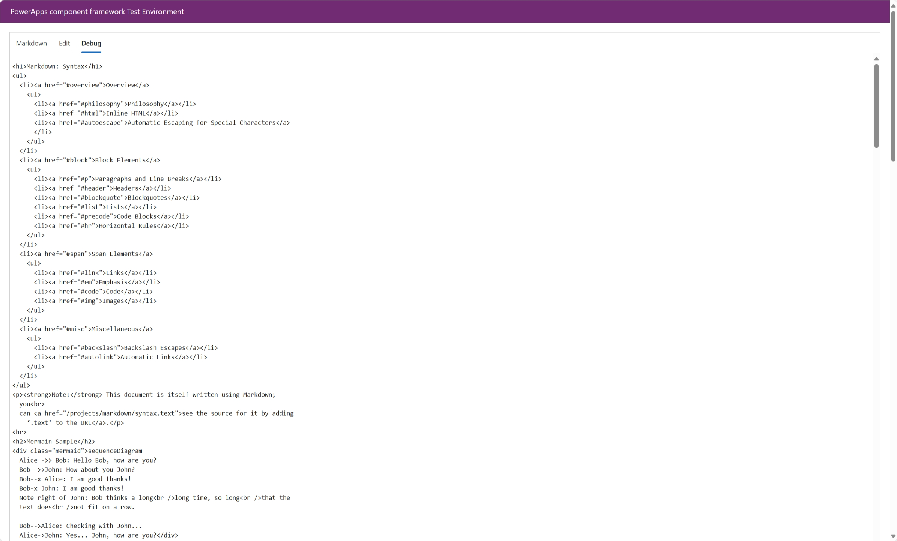
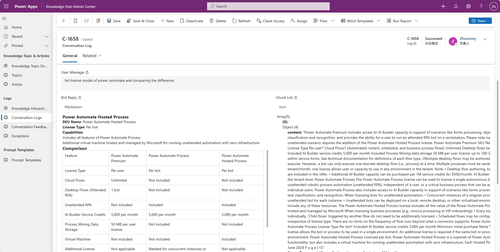

# PCF Universal Textbox Fluent

This project is a PowerApps Component Framework (PCF) control that provides a universal textbox component using Fluent UI React v9. The component supports multiple text formats including Markdown, JSON, HTML, Rich Text, and Plain Text. It also includes a debug mode for viewing the rendered HTML.

## Features

- **Multiple Text Formats**: Supports Markdown, JSON, HTML, Rich Text, and Plain Text.
- **Fluent UI Integration**: Utilizes Fluent UI React v9 components for a modern and consistent user interface.
- **Debug Mode**: Allows viewing the rendered HTML for debugging purposes.
- **Responsive Design**: Ensures that images and other content adapt to the container's width.
- **Mermaid Diagrams**: Renders Mermaid code blocks as diagrams within Markdown.

## Screenshots
Markdown view

Json view

Debug view

Presenting in Model Driven Apps


## Installation

### Option 1, Use the latest release package

Check the latest solution package under release

### Option 2, Clone the source code and build by youself

1. **Clone the repository**:
   ```sh
   git clone https://github.com/yourusername/PCF-Universal-Textbox-Fluent.git
   cd PCF-Universal-Textbox-Fluent
   ```

2. **Install dependencies:**
   ```sh
   npm install
   ```

3. **Run the application:**
   ```sh
   npm start
   ```

## Usage

- The main application component is located in `src/App.tsx`.
- The entry point for the application is `src/index.tsx`.
- Custom components can be created in the `src/components` directory, utilizing Fluent UI React v9 components.

## Deployment Notice

When deploying the PCF control, you might encounter an error stating that the webresource content size is too big. To avoid this error, ensure that your environment settings allow for a larger attachment size. In your Power Apps / Dynamics 365 administration:

1. **Adjust the Attachment Size Limit:**
   - Navigate to the environment settings.
   - Locate the **Attachments maximum file size** under **Email settings**.
   - Increase the limit to accommodate your optimized bundle size (for this release I set the attachment size to 102400kb).

2. **Optimize Your Bundle:**
   - Use production mode, minification, and code splitting as configured in the project’s webpack configuration.
   - Remove unused dependencies to reduce the overall bundle size.

## Contributing

Feel free to submit issues or pull requests for improvements or bug fixes.

## License

This project is licensed under the MIT License.